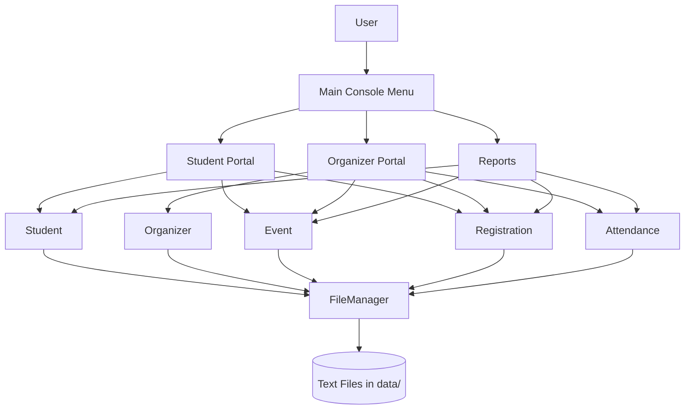

# System Architecture

## Architectural style

The application follows a simple layered/modular console architecture:

- **Presentation layer:** `Main`, `Student`, `Organizer`, and menu methods.
- **Domain/data layer:** `Student`, `Event`, `Registration`, `Attendance`, `Organizer`.
- **Utility layer:** `Validator` and `FileManager`.
- **Reporting layer:** `Report`.
