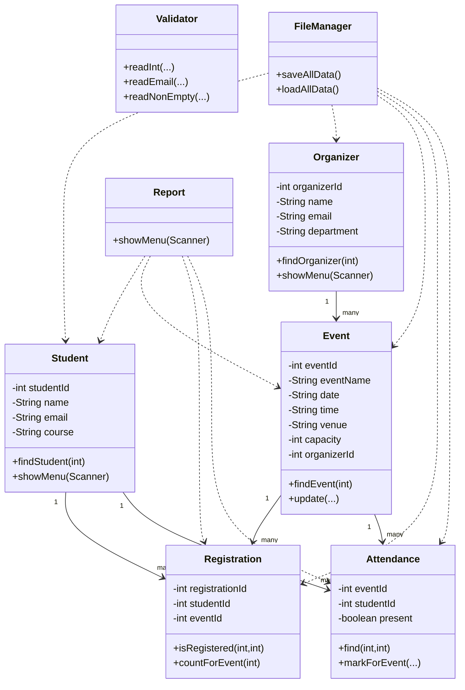

# Class Diagram

```mermaid
classDiagram
    class Student {
        -int studentId
        -String name
        -String email
        -String course
        +findStudent(int)
        +showMenu(Scanner)
    }

    class Organizer {
        -int organizerId
        -String name
        -String email
        -String department
        +findOrganizer(int)
        +showMenu(Scanner)
    }

    class Event {
        -int eventId
        -String eventName
        -String date
        -String time
        -String venue
        -int capacity
        -int organizerId
        +findEvent(int)
        +update(...)
    }

    class Registration {
        -int registrationId
        -int studentId
        -int eventId
        +isRegistered(int,int)
        +countForEvent(int)
    }

    class Attendance {
        -int eventId
        -int studentId
        -boolean present
        +find(int,int)
        +markForEvent(...)
    }

    class Report {
        +showMenu(Scanner)
    }

    class Validator {
        +readInt(...)
        +readEmail(...)
        +readNonEmpty(...)
    }

    class FileManager {
        +saveAllData()
        +loadAllData()
    }

    Student "1" --> "many" Registration
    Event "1" --> "many" Registration
    Event "1" --> "many" Attendance
    Student "1" --> "many" Attendance
    Organizer "1" --> "many" Event
    Report ..> Student
    Report ..> Event
    Report ..> Registration
    Report ..> Attendance
    FileManager ..> Student
    FileManager ..> Organizer
    FileManager ..> Event
    FileManager ..> Registration
    FileManager ..> Attendance
```
