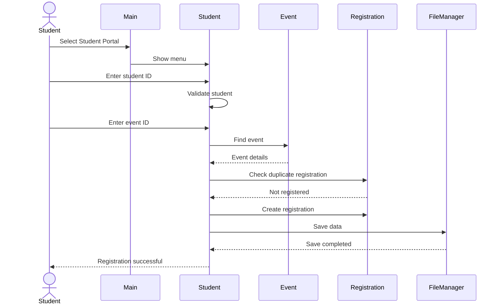

# Sequence Diagram – Student Event Registration

```mermaid
sequenceDiagram
    actor Student
    participant Main
    participant StudentPortal as Student
    participant Event
    participant Registration
    participant FileManager

    Student->>Main: Select Student Portal
    Main->>StudentPortal: Show menu
    Student->>StudentPortal: Enter student ID
    StudentPortal->>StudentPortal: Validate student
    Student->>StudentPortal: Enter event ID
    StudentPortal->>Event: Find event
    Event-->>StudentPortal: Event details
    StudentPortal->>Registration: Check duplicate registration
    Registration-->>StudentPortal: Not registered
    StudentPortal->>Registration: Create registration
    StudentPortal->>FileManager: Save data
    FileManager-->>StudentPortal: Save completed
    StudentPortal-->>Student: Registration successful
```
