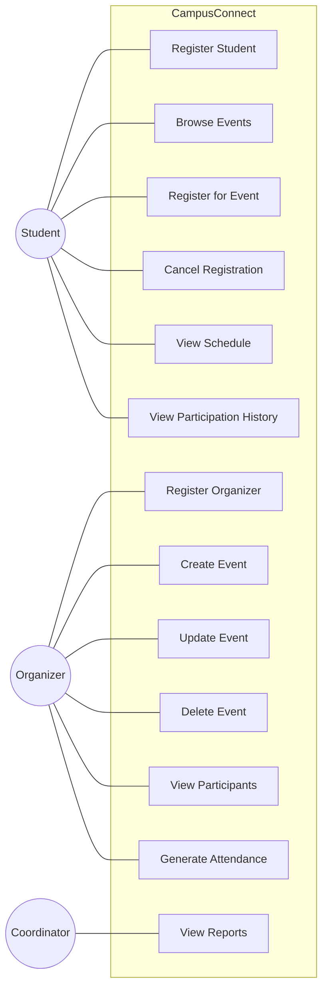

# Use Case Diagram

```mermaid
flowchart LR
    Student((Student))
    Organizer((Organizer))
    Coordinator((Coordinator))

    subgraph CampusConnect
        UC1[Register Student]
        UC2[Browse Events]
        UC3[Register for Event]
        UC4[Cancel Registration]
        UC5[View Schedule]
        UC6[View Participation History]

        UC7[Register Organizer]
        UC8[Create Event]
        UC9[Update Event]
        UC10[Delete Event]
        UC11[View Participants]
        UC12[Generate Attendance]

        UC13[View Reports]
    end

    Student --- UC1
    Student --- UC2
    Student --- UC3
    Student --- UC4
    Student --- UC5
    Student --- UC6

    Organizer --- UC7
    Organizer --- UC8
    Organizer --- UC9
    Organizer --- UC10
    Organizer --- UC11
    Organizer --- UC12

    Coordinator --- UC13
```
