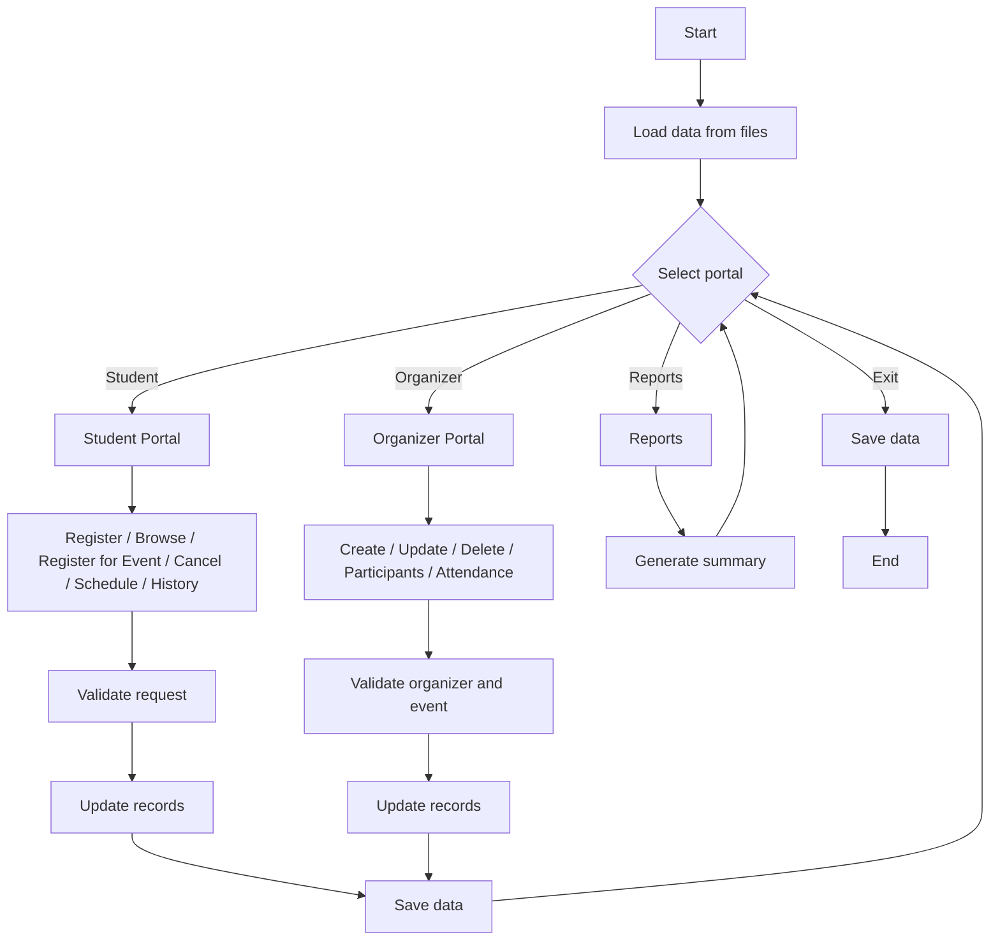

# Process Workflow

```mermaid
flowchart TD
    A[Start] --> B[Load data from files]
    B --> C{Select portal}

    C -->|Student| D[Student Portal]
    C -->|Organizer| E[Organizer Portal]
    C -->|Reports| F[Reports]

    D --> D1[Register / Browse / Register for Event / Cancel / Schedule / History]
    D1 --> G[Validate request]
    G --> H[Update records]
    H --> I[Save data]

    E --> E1[Create / Update / Delete / Participants / Attendance]
    E1 --> J[Validate organizer and event]
    J --> K[Update records]
    K --> I

    F --> F1[Generate summary]
    F1 --> C

    I --> C
    C -->|Exit| L[Save data]
    L --> M[End]
```
